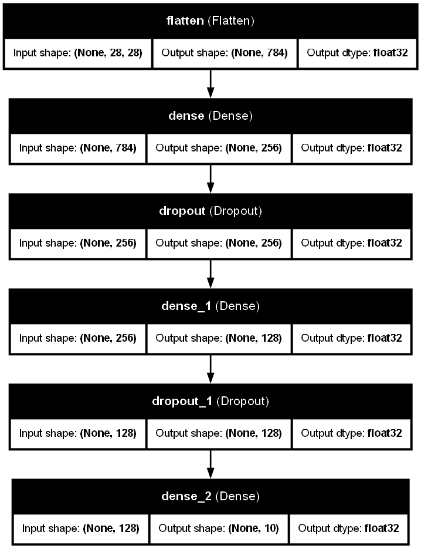
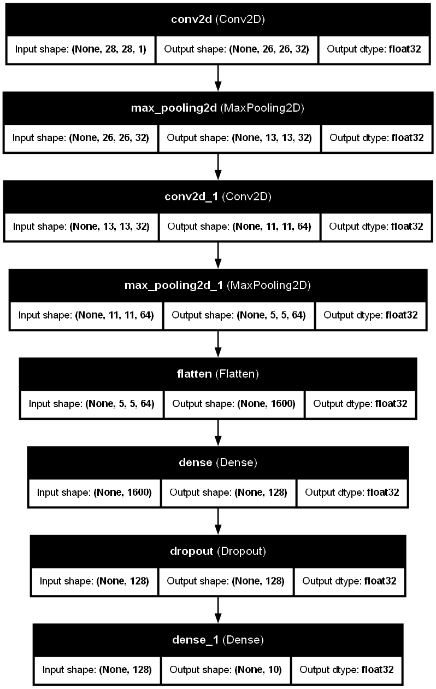
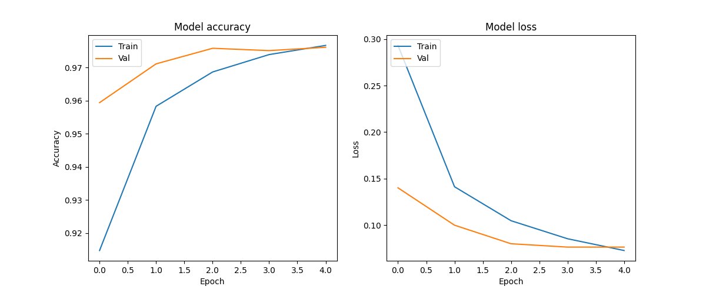
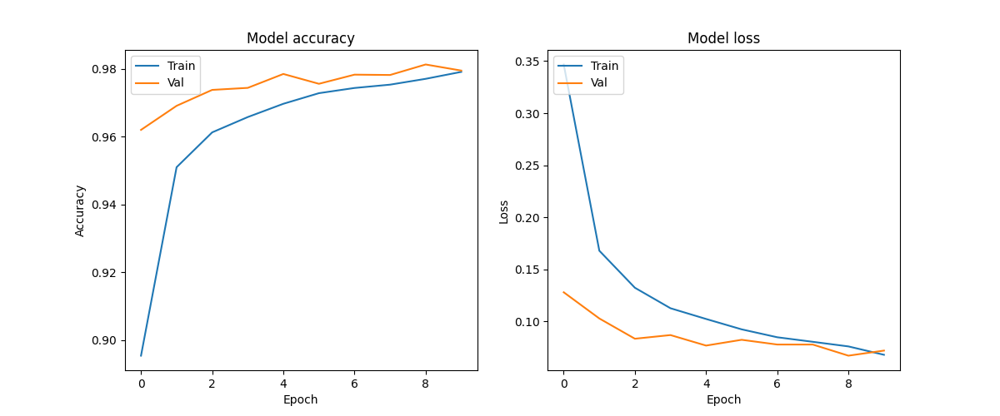
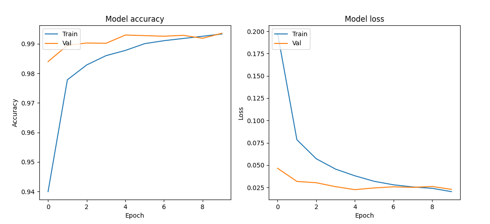
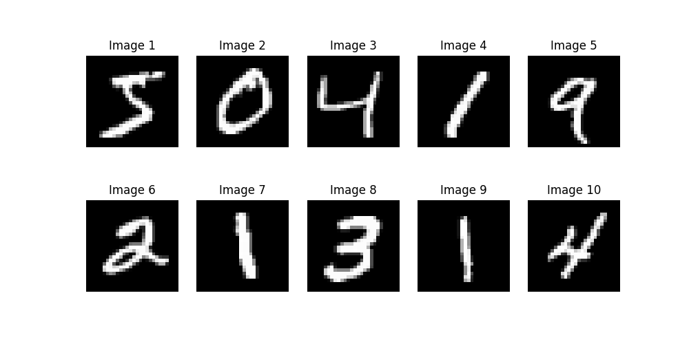
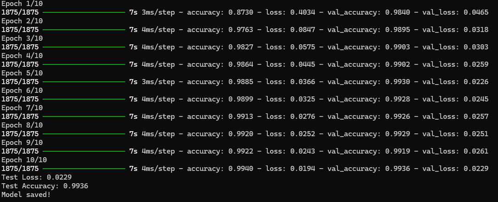
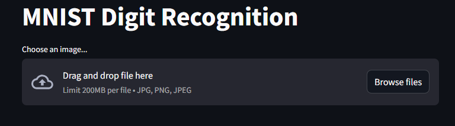
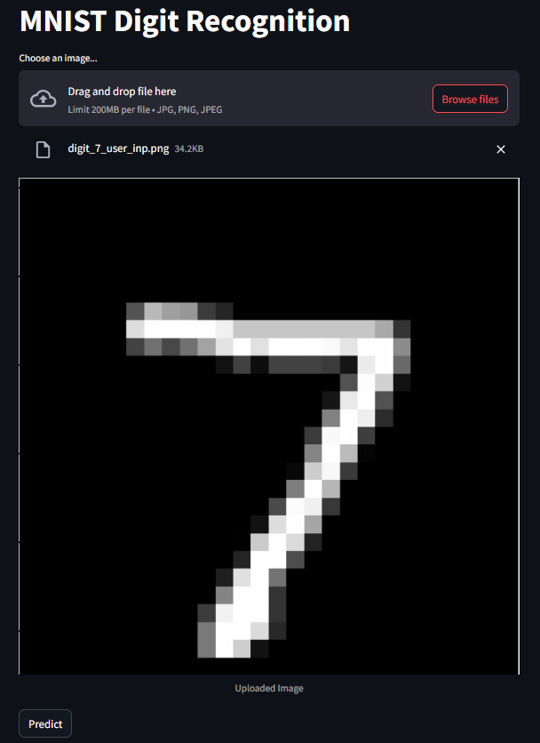
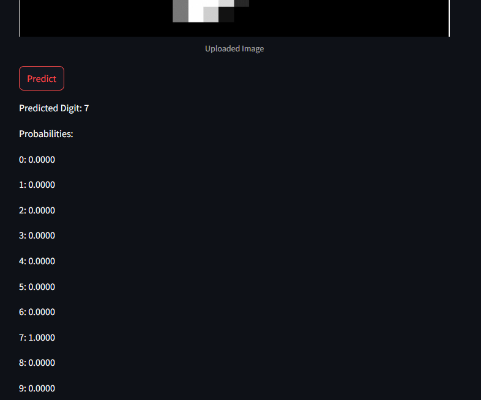

# MNIST Digit Recognition

This is a learning project implementing a simple Aritificial Neural Network & Convolution Neural Network for recognizing handwritten digits from the MNIST dataset.  The project also includes a Streamlit web application for easy interaction with the trained model.

## Table of Contents

*   [Project Structure](#project-structure)
*   [Architecture](#architecture)
    *   [Artificial Neural Network (ANN)](#artificial-neural-network-ann)
    *   [Convolutional Neural Network (CNN)](#convolutional-neural-network-cnn)
*   [Training & Evaluation](#training--evaluation)
    *   [ANN - 5 Epochs](#ann---5-epochs)
    *   [ANN - 10 Epochs](#ann---10-epochs)
    *   [CNN - 10 Epochs](#cnn---10-epochs)
*   [Data](#data)
*   [CNN Training Results](#cnn-training-results)
*   [Streamlit App](#streamlit-app)
    *   [Home Screen](#home-screen)
    *   [Uploaded Image](#uploaded-image)
    *   [Digit Recognition](#digit-recognition)
*   [Libraries Used](#libraries-used)
*   [Cloning the Repository](#cloning-the-repository)

## Project Structure

```
mnist_digit_recognition
├── Images
│   ├── Data.png                           # Sample images from the MNIST dataset
│   ├── model_architecture.png             # Visualization of the model architecture
│   ├── model_acc_loss_with_5_epochs.png    # Training/validation accuracy and loss (5 epochs)
│   ├── model_acc_loss_with_10_epochs.png   # Training/validation accuracy and loss (10 epochs)
│   ├── streamlit_app_home_screen.png      # Streamlit app home screen
│   ├── streamlit_app_uploaded_img.png     # Streamlit app after image upload
│   └── streamlit_app_digit_recognition.png # Streamlit app showing digit recognition
├── app.py                                 # Streamlit web application code
|-- cnn_model.py
├── main.py                                # Main script for training, evaluating, and saving the model
├── mnist_model.keras                      # Saved Keras model file (.keras format)
├── README.md                              # This file (project documentation)
├── utils.py                               # Utility functions for data loading and preprocessing
└── visualize.py                           # Visualization functions for training history and model architecture
```

*   **`Images`:** Contains images used in the `README` and potentially for visualizing data or model outputs.
*   **`app.py`:** The Streamlit application code, which allows users to upload images and get predictions from the model.
*   **`cnn_mode.py:`** Contains code for CNN model architecture.
*   **`main.py`:** The main Python script that handles data loading, model creation, training, evaluation, and saving.
*   **`mnist_model.keras`:** The saved Keras model file.
*   **`README.md`:** This file, providing information about the project.
*   **`utils.py`:** Contains utility functions for loading and preprocessing the MNIST data.
*   **`visualize.py`:** Contains functions for visualizing the training history (accuracy and loss) and the model architecture.

## Architecture

### Artificial Neural Network (ANN)



### Convolution Neural Network (CNN)



The model architecture consists of a simple ANN & CNN.  This are a relatively simple architecture suitable for CPU training.

## Training & Evaluation

The model was trained using the MNIST dataset. The following plots show the training and validation accuracy and loss curves for 5 and 10 epochs of training.

### 5 Epochs -- ANN only



### 10 Epochs 

#### ANN 



#### CNN



## Data

The MNIST dataset was used for training and evaluation.  It consists of 60,000 training images and 10,000 testing images of handwritten digits (0-9).



## Training results from CNN 



## Streamlit App

The project includes a Streamlit web application that allows users to upload an image of a handwritten digit and get a prediction from the trained model.

### Home Screen



### Uploaded Image



### Digit Recognition



## Libraries Used

*   **TensorFlow/Keras:** Used for building, training, and evaluating the CNN model.  Installation: `pip install tensorflow`
*   **NumPy:** Used for numerical operations, especially for image preprocessing. Installation: `pip install numpy`
*   **Pillow (PIL):** Used for image processing, such as resizing and converting images. Installation: `pip install Pillow`
*   **Streamlit:** Used for creating the interactive web application. Installation: `pip install streamlit`
*   **Matplotlib:** Used for visualizing the training history. Installation: `pip install matplotlib`
*   **Graphviz:** Used for visualizing the model architecture.  Installation instructions can be found at: [https://graphviz.gitlab.io/download/](https://graphviz.gitlab.io/download/).  You might also need to install the Python wrapper: `pip install graphviz`.  Graphviz is used by Keras' `plot_model` utility to generate the model architecture visualization.

## Cloning the Repository

To clone this repository, use the following command:

```bash
git clone https://github.com/UmerSalimKhan/Mnist-Digit-Recognition.git
```
